# 【275級版本】遠程物理系魔劍士

作者托蘭遊戲內ID：詩音  （托拉姆ID：诗音姬）

***轉載必須註明出處並附上地址！！！***
***
本篇將介紹一種魔劍士（即 主武器單手劍 副武器魔導具）與眾不同的特殊玩法，僅使用聯合巨劍與再聯合巨劍進行輸出，有別於使用附魔劍擊的玩法，優點在於可以遠程安全進行輸出，同時有著不俗的傷害。

本攻略玩法的聯合與再聯合巨劍類型為物理傷害，所以一切以此為核心。
## 目錄
1. [能力加點](#能力加點)
2. [技能配置](#技能配置)
3. [裝備配置](#裝備配置)
4. [輸出方法與連擊設置](#輸出方法與連擊設置)
5. [料理與消耗品](#料理與消耗品)
6. [總結與補充](#總結與補充)

## 能力加點
由於我們選擇的是物理流派，所以採用

**STR465 > DEX247**

## 技能配置
（介紹、加點、星石、托環）
### 技能介紹及加點
**現版本滿級技能點370左右，請自行計算取捨。**

*圖片中紅色圈圈為必要加點，藍色圈圈為推薦可選加點。*
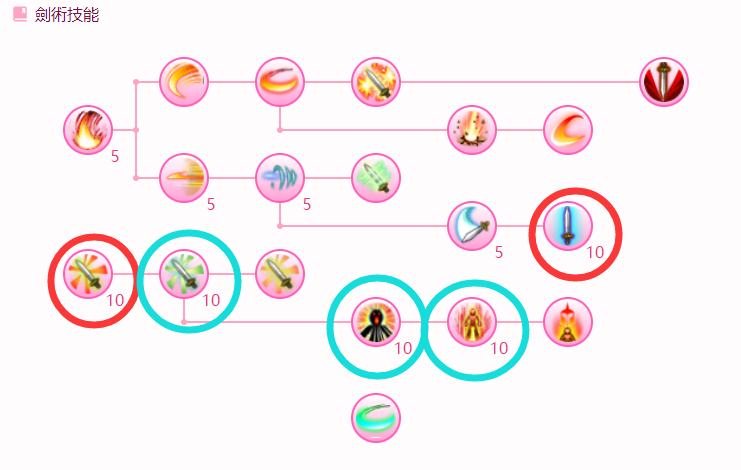
- 靈氣之刃：使所有技能最終傷害+20%，提升可觀
- 劍術要領：ATK+3% 武器ATK+30% 提供大量atk 必點
- 劍速提升：攻擊速度+100 攻擊速度+10% 提供少量速度 可選
- 戰吼：全隊伍增益ATK+10% 可選 通常隊伍中由坦或傭兵來提供
- 狂戰士之怒：提供大量速度，可選
- 音速斬切：常用于連擊起始技，接近敵人。
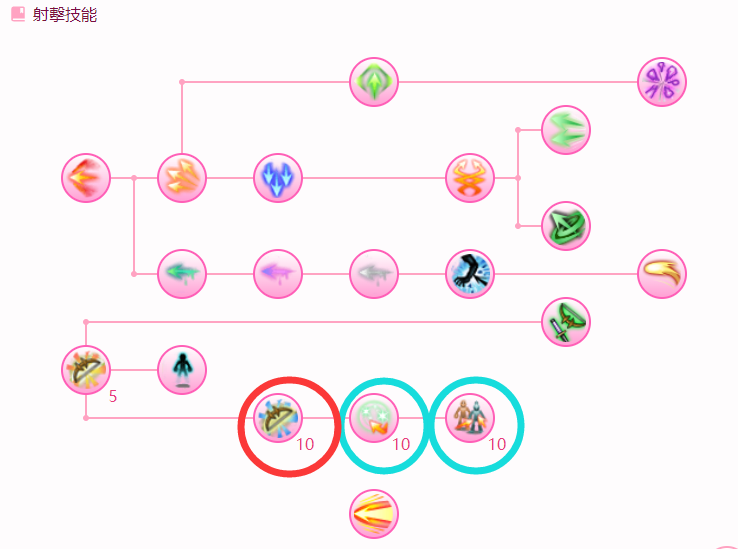
- 遠程狙擊：最大射程大於等於8m的攻擊技能，總傷害+10% 給聯合巨劍及再聯合巨劍提供巨大增傷
- 回氣：提供少量mp回復
- 分身射手：創造一個分身，攻擊敵人回復MP。雖然我們學了強射，但由於分身只有近身才會攻擊，且我們可以使用魔力灌充回復因此非必須
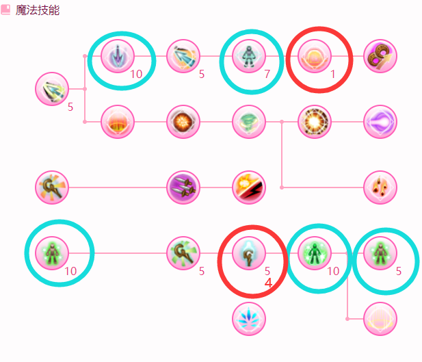
- 終結：常用於中斷連擊 必學
- 強射：普通攻擊變成7m遠程攻擊，如不學魔力灌充則只點**4**即可，千萬別超過5點，否則有可能吃不到近距離威力（7m以內都是近距離威力，點多了普攻距離會超過7m）！
- 魔力充填：配合魔力灌充回復魔法值，如不學魔力灌充則只點5即可！
- 魔力灌充：回復魔法值的技能，很好用，與分身射手可選一學習。
- 急速充填：配合魔力灌充使用，可選點5即可。
- 衝擊波：點7可無需詠唱，一般用不到，點5路過。
- 法術/長槍：配合魔劍技能樹裡的 附魔之咒 使用，點10有100%機率使目標陷入異常（根據屬性），通常副武器使用光屬性魔導具用於造成眩暈（對於BOSS敵人，期間內總閃躲率及總阻擋率減半；一般敵人則歸零。），點5路過。
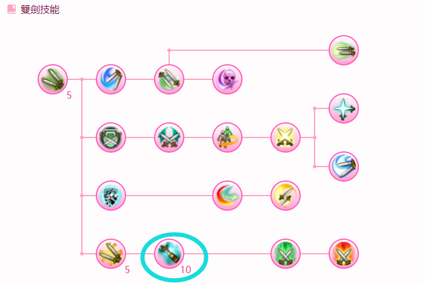
- 神速軌跡：被動，AGI+15，提供一些攻擊速度，一般用不到。
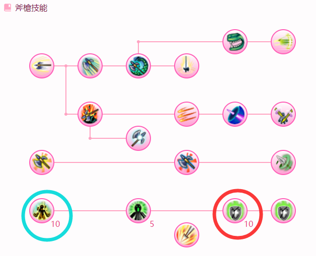
- 破風之勢：攻擊速度+500並且攻擊速度+25%，如果速度不夠可以點10，否則點5路過。
- 神速掌握：犧牲生存能力與最大MP上限，大幅提高行動速度。可透過重覆施放提高效果（最多三層）。由於再聯合巨劍須要速度夠快才能放出來，因此必點！
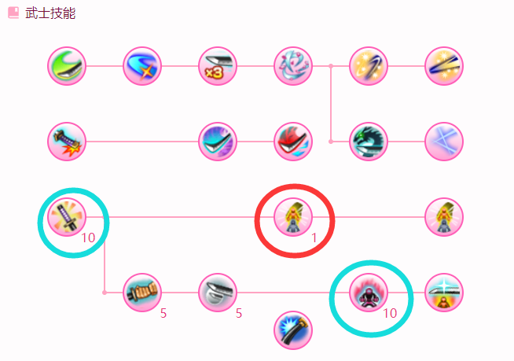
- 縮地法：必點1，不用多說。
- 武士道：點10多提供50MP上限，可選。
- 怪力亂神：施放成功後自身增益ATK+100攻擊MP回復+25同時配合托環可回復MP，很好用的起始技能，推薦點10，也可以不點。
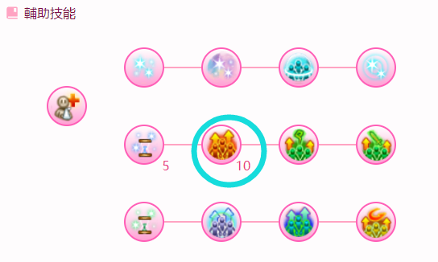
- 勇氣泉源：光環，施放成功後武器ATK+30%，最終傷害+20%。大量增傷！強烈推薦點10！當然，因為可以蹭隊友的也不是必須自己學。
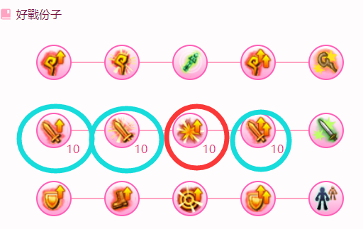
- 提升暴擊率：暴擊率+5暴擊傷害+5% ，必點10。
- 強打：有機率使總傷害提升20%。提升攻擊力、威嚇之力：提供atk加成。點5路過，如果技能點富足請全部點滿。

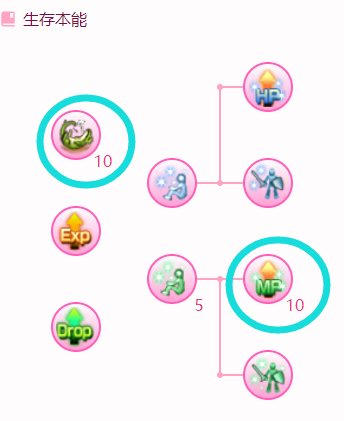
- MP突破：MP上限+300，為了使MP最大值達到2000可點，推薦10。
- 裝死：總復活時間-50%，好用，誰用誰知道，推薦10，技能點不足可放棄。

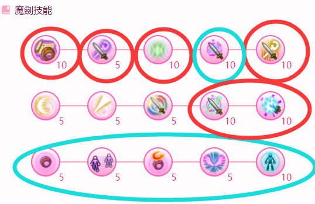
- 魔法戰士的要訣：ATK+15%，提供大量atk和詠唱速度，必須點10。
- 轉化：用於主動釋放切換附魔爆發的物理模式(從而使用附魔攫取)來疊附魔之力層數，因為我們不需要被打效果提供的面板MATK，所以點5即可。
- 魔力共鳴：將當前HP與MP之剩餘比例平均化，通常用於回復MP。並隨機從3種buff獲得一種，配合托環使用可穩定獲得固定增益！點10級。
- 附魔之咒：10級可減少發動的冷卻時間，如不需要可點5路過。常用異常抗體、衝擊波、法術/長槍等，常用設定一般攻擊時、受到目標傷害時、使用閃躲時。[詳細介紹請點此處閱讀](https://cy-grimoire.netlify.app/skill/4-1-6)
- 雙重提供：點10以後對我們有用的效果就是讓我們的MATK等於ATK（的100%），因為再聯合巨劍的傷害倍率是（MATK+ATK）計算的，所以這是必須使用的增益。持續時間和副武器魔導具的攻擊力有關，推薦帶330以上攻擊力的魔導具。
- 附魔爆發：無限距離遠程，給予自身魔劍強化，才能釋放再聯合巨劍。必點10，用於提供附魔之力層數，我們只需要用到它轉化後的物理模式(附魔攫取)。
- 聯合巨劍：主要輸出手段，我們用的是通常模式(物理)。若處於魔劍強化狀態將消耗其30秒持續時間使此技能迅速發動；若扣除時間後仍處於魔劍強化狀態，並同時按下前方向鍵，則解除魔劍強化狀態的同時，繼續發動再聯合巨劍。無論魔劍強化剩餘幾秒，都能發動加速效果，但若想發動再聯合巨劍，則必須有至少31秒魔劍強化。聯合巨劍12m；再聯合巨劍8m，且必定暴擊~
- 魔法膜：點10或不點。魔導具必須精煉到S，受到的物理/魔法傷害減輕50%，受到超出自身最大HP的傷害時有100%機率迴避死亡、HP剩餘1，並使魔法膜的效果中斷120秒，期間內無法再次發動免死效果。

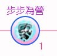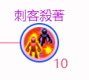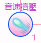
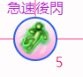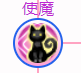
- 步步為營：1，連擊起始技，常用星石。
- 即興演出：1，連擊起始技，吟遊詩人技能書。
- 優雅架勢：1，無敵技，會打斷神速掌握和勇氣泉源，與魔法膜衝突，舞者技能書。
- 音速擠壓：10，**穩定遠程翻覆控制技**，但消耗技能點過多，騎士精神技能樹。
- 急速後閃：1，迅速朝反方向移動5m，遠離敵人；刺客殺著：10，ATK+50 物理貫穿+10%，不好用；暗殺技能樹。
- 使魔：10，MP上限+200，不好用。

### 推薦星石
**根據財力自行選擇**

*劍術要領|劍速提升|戰吼|遠程狙擊|魔力充填|法術/長槍|神速軌跡|破風之勢|武士道|勇氣泉源|提升攻擊力|強打|裝死|MP突破|步步為營*

### 雷吉斯托環
- **燃燒的鬥志**
- **魔力灌充．切換**
- **三選一：**
>魔力共鳴．火力   
>魔力共鳴．速度   
>魔力共鳴．專注
- 提升攻擊速度
- 提升詠唱速度
- 提升MP上限
- 提升物理攻擊
- 曬太陽
- 恐慌
- 戰吼．克服
- 強打．真髓

## 裝備配置
採用缺什麼補什麼的原則。

主要使用提供ATK、STR、物理貫穿、暴擊率、近距離威力、攻擊速度、MP上限、暴擊傷害之類屬性的裝備。

我們要物理ATK以及物理貫穿，堆近距離威力，STR，攻擊速度（行動速度），MP上限、暴擊傷害與暴擊率等。
### 主武器-單手劍
需精煉至S
#### 8周年寶劍

**通用附魔詞條數值優先級推薦：** ATK%-STR%-暴擊傷害%-暴擊傷害-暴擊率（可選）

**由於魔劍技能自帶屬性覺醒，所以武器附魔無需進行屬性覺醒。**（魔劍技能樹技能傷害屬性皆必定是敵方弱點屬性；若敵方為無屬性，則變為無屬性。）

**對屬附魔詞條數值優先級推薦：** 對屬性傷害%-ATK%-STR%-暴擊傷害-暴擊率（可選）

#### 武器鍛晶
***魔糰子|炎龍布蘭瑪|東．普羅芬多**|黑衣聖誕公主|三足怪鳥|威琉魔|多雷米納雷爾|樂龍雷多爾基|原初之誘月華|欺龍米繆加*
### 副武器-魔導具
魔導具副武器無需精煉，無需附魔，無需鍛晶。使用法術/長槍時推薦屬性覺醒為光屬性，使用魔法膜時推薦精煉至S。
雙重提供持續時間受魔導具副武器ATK影響，建議選用不低於330ATK的。
##### 女王翅（限定推薦）
取得方式：定點BOSS蜜愛麗 萊卡平原(情人節活動)
##### 穿山甲殼（常駐）

### 身體裝備
需**輕化防具**

#### 防具附魔
**通用附魔舉例：** 

ATK%-STR%-暴擊傷害%-暴擊傷害

ATK%-STR%-暴擊傷害-暴擊率

**對屬附魔舉例：** 

對屬性傷害%-STR%-暴擊傷害-暴擊率

**退潛盡量不退MATK%！！！會降低再聯合巨劍的傷害輸出 詳見如下**
>（雙重提供：假如角色帶有諸如「MATK-10%」之類的效果，則會受到懲罰。注意是只要有任意來源的效果中帶有-MATK%，即使最終的MATK%加成為正，仍然會吃到懲罰。）
#### 防具鍛晶
***席比拉雷斯|阿魯塔達爾**|薩波|尤維麗婭|兔麻糬|波姆波姆博士|DX法伊特II|寶蓋熊|晶瑪體*

### 追加裝備
由於我們點了DEX，所以不缺少穩定率。

***聖誕樹**|疼痛的右臂|奈亞達寶冠|絡腮長鬚*  等根據財力自行選擇~

#### 追加鍛晶
***邪惡雷菲娜|王之鬥牛王|糖明凰**|畢龍災比歐|深謀的青影|大綿羊駝|†闇王†*

### 特殊裝備
有什麼帶什麼，優先雙孔。

***爛漫守石|惡作劇懷錶**|黑暗護符(力)|穿越時空的懷錶|晝櫻守石|熊戰士腰帶|海馬手環|幻惑茸香|覺醒者手環|獸牙護身符*  等根據財力自行選擇~

#### 特殊鍛晶
***愛德華茲|席卡諾加米**|多米納雷多爾|塔圖羅基特|圖雷茲|黏液諾瓦II|茄龍歐瓦比昂*

#### 通用鍛晶
*變異幽靈牛|黑影|佛拉布喇*

## 輸出方法與連擊設置

### 推薦連擊

**開局疊附魔之力層數：** 步步為營/即興演出 > 附魔爆發（心眼）

**主要輸出：** 

怪力亂神 > 附魔爆發（心眼） > 轉化（連擊） > 聯合巨劍（增幅） > 終結（增幅）

附魔爆發 > 轉化（連擊） > 聯合巨劍（增幅） > 終結（增幅）

**增益：**

靈氣之刃 > 雙重提供（補位） > 魔力共鳴 > 終結（增幅）

音速斬切 > 分身（補位） > [戰吼 >] 終結（增幅）

### 輸出方法

**開局釋放BUFF技能：**
1. 破風之勢；
2. 神速掌握x3；
3. 勇氣泉源；
4. 轉化；
   
**輸出前準備：**

1. 疊附魔之力層數連擊x3；
2. 靈氣之刃增益連擊；
   
**輸出：**

1. 怪力亂神或附魔爆發連擊~打出聯合巨劍與再聯合；
2. 轉化；
3. 循環1、2；
   
**注意：**

1. 神速掌握持續時間；
2. 慣性與疊傷；
3. 使用音速斬切分身連擊或魔力灌充回復MP；
4. 轉化不能忘記；
5. 續增益BUFF；

## 料理與消耗品

### 常用料理
- MP上限+1000
- 恨意值-100%
- 攻擊MP回復+30
- 暴擊率+30
- STR+30
- 武器ATK+100
- 對屬性傷害+15%
### 常用消耗品
- 穿甲油：ATK+3%物理貫穿+10%
- 神速魔壺：攻擊速度+1000
- 嫩煎羅諾戈蝦/葡萄果凍：MP上限+300詠唱速度+250
- 阿健章魚燒：暴擊率+15
- 魔力藥6：MP上限增加600
- 澎湃藥丸：ATK+50ATK+5%
- 松茸湯/浸炸茄子：武器ATK+10%攻擊MP回復+10
- 各屬性強化：對屬性傷害+5%攻擊速度+100詠唱速度+100
- 詠咒耳機：詠唱速度+700
- 龍肉排：HP上限+1500攻擊速度+250
- 婚宴用酒、禁斷樹果、南瓜脆片等

## 總結與補充
至此，感謝您已經耐心看完本篇攻略，共計4500字。快去遊戲中試試吧，如果有什麼不懂的問題歡迎來問我。